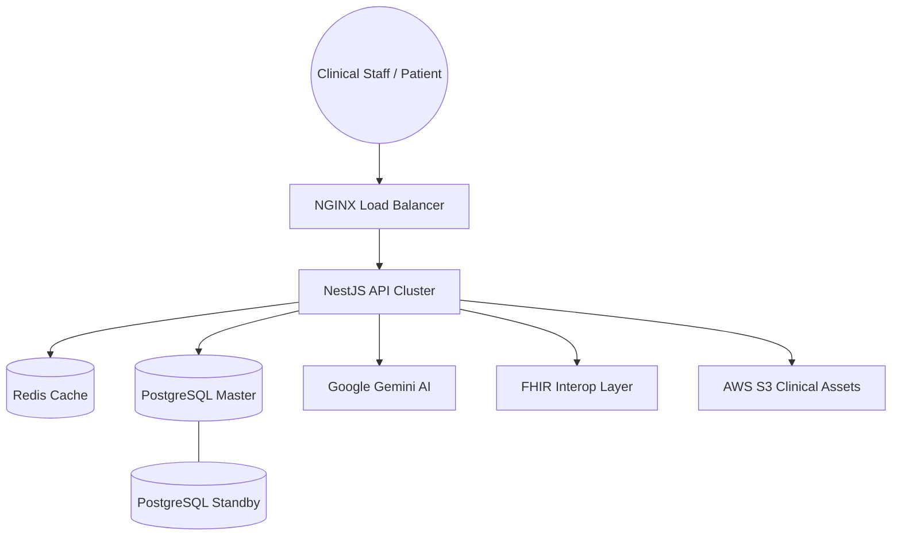

# MediPortal Enterprise Architecture

## 1. System Overview
MediPortal is a globally scalable, multi-tenant Hospital ERP and EHR ecosystem built on a modern TypeScript monorepo.

### High-Level Architecture

## 2. Core Modules
- **`apps/api-server`**: NestJS backend providing clinical core, AI integrations, and FHIR R4 endpoints.
- **`apps/admin-hms`**: Vite/React dashboard for doctors, nurses, and admins.
- **`apps/mobile-patient`**: React Native (Expo) app for patient health tracking and RPM.
- **`packages/database`**: Prisma-based data modeling and migrations.
- **`packages/shared-types`**: Unified TypeScript interfaces across the stack.

## 3. Multi-Tenancy & Security
- **Isolation**: Tenant isolation is enforced at the request level via `TenantInterceptor`, ensuring branch-level data partitioning.
- **Auth**: RBAC (Role-Based Access Control) using JWT.
- **Privacy**: Automated PII Scrubbing via `GeminiService` for all AI-assisted workflows.

## 4. Disaster Recovery
1. **DB Failover**: Multi-AZ RDS handles automatic standby promotion (RTO < 60s).
2. **Point-in-Time Recovery**: Use AWS Console or CLI to restore via WAL logs to any second within 35 days.
3. **Regional Outage**: DNS (Route53) will reroute traffic to the standby region (`us-east-1`).

## 5. CI/CD Pipeline
- **Lint & Test**: Triggered on every Pull Request.
- **Build**: Turborepo handles parallel builds with remote caching.
- **Deploy**: Dockerized images pushed to ECR and deployed to ECS Fargate.
